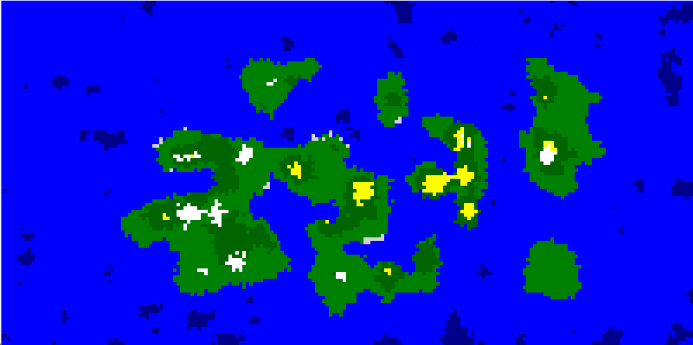
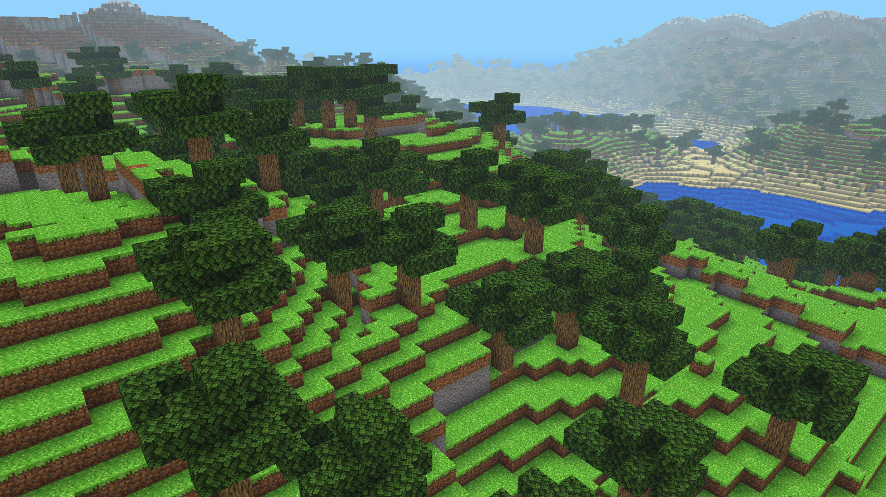
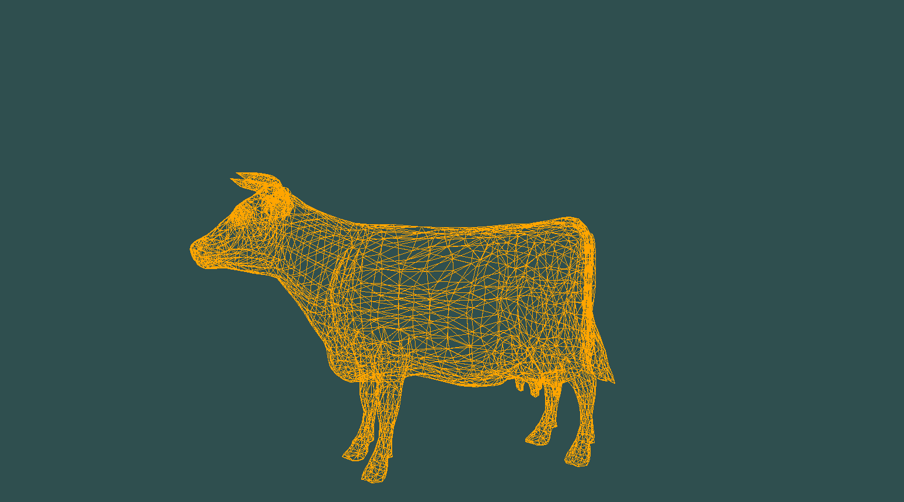
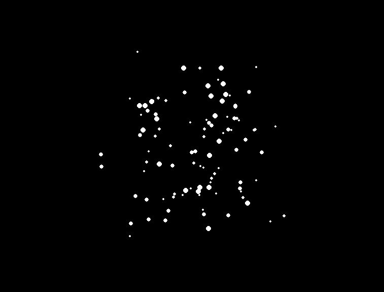
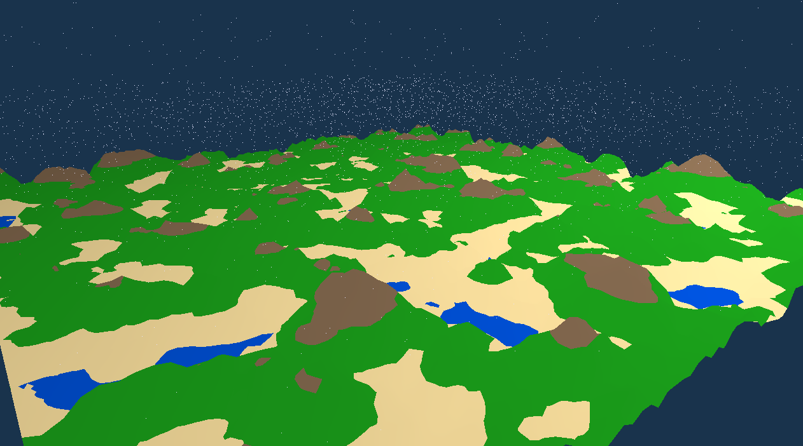

# GraCom_2d-3dEx
Examples of 3D/2D Grafication with python
# 🖥️✨ Algoritmos de Gráficos por Computadora en Python

Este repositorio contiene una colección de tres proyectos enfocados en la visualización, simulación y estudio de algoritmos fundamentales para gráficos por computadora en entornos 2D y 3D, utilizando el lenguaje de programación **Python**. Cada uno de estos proyectos explora un aspecto esencial en el campo de la generación de gráficos, desde la generación procedural de terrenos hasta la carga y renderizado de modelos 3D, y la simulación de sistemas de partículas.

---

## 🌍 Proyecto 1: Generación Procedural de Terrenos con Perlin Noise

### 🧩 Descripción General

Este proyecto se centra en el uso del algoritmo **Perlin Noise** para generar terrenos de forma procedural, una técnica muy utilizada en videojuegos, simulaciones y entornos generados dinámicamente. Se desarrollaron dos aplicaciones:

- **Mapa de terreno 2D**: Generación en tiempo real de mapas topográficos con diferentes niveles de elevación y detalles visuales. Se representan las alturas usando degradados de color para simular tierra, agua, montañas y nieve.
- **Terreno 3D estilo voxel (Minecraft-like)**: Un entorno tridimensional construido con bloques o *voxeles*, en donde el terreno se genera con Perlin Noise tridimensional. Cada bloque representa una unidad de terreno y puede simular colinas, estanques o formaciones montañosas.

### 🛠 Tecnologías Utilizadas

- `numpy` y `noise` para la generación de Perlin Noise.
- `pyrr` y `tkinter` para visualización 2D.
- `PyGLM`, `moderngl` y `opensimplex` para el entorno 3D voxel.

### 📸 Capturas

| Mapa 2D | Voxel 3D |
|--------|----------|
|  |  |

---

## 🧱 Proyecto 2: Motor de Visualización 3D y Teselación de Modelos OBJ

### 🧩 Descripción General

Este proyecto simula el funcionamiento interno de un motor gráfico básico en 3D. El enfoque principal es el análisis visual de modelos `.obj`, mostrando sus vértices, caras, y estructuras de malla. A través de esta visualización se puede comprender:

- Cómo se importan modelos en formato OBJ.
- El proceso de **teselación**, es decir, cómo se dividen las superficies en triángulos.
- El renderizado de los modelos desde distintas cámaras y luces.

Se incluyen herramientas para cargar modelos personalizados y rotarlos, escalar o moverlos en el espacio 3D.

### 🛠 Tecnologías Utilizadas

- `pygame` y `numpy` para renderizado en tiempo real.
- Parsers personalizados en Python para leer archivos `.obj`.
- Transformaciones 3D: matrices de rotación, proyección y translación.

### 💡 Funcionalidades Clave

- Visualización de vértices, aristas y caras.
- Control de cámara 3D básico.
- Soporte para iluminación rudimentaria (shading plano).

### 📸 Captura de Pantalla



---

## 🔥 Proyecto 3: Simulación de Sistemas de Partículas 3D

### 🧩 Descripción General

Este proyecto abarca tanto un pequeño videojuego como herramientas de visualización dedicadas a mostrar el funcionamiento de **sistemas de partículas** en 3D. Los sistemas de partículas son esenciales en gráficos por computadora para simular fenómenos como:

- Fuego
- Niebla
- Explosiones
- Magia o efectos visuales en juegos

Además de la simulación, se incluye un videojuego simple en donde estos efectos de partículas enriquecen la experiencia visual del entorno.

### 🛠 Tecnologías Utilizadas

- `OpenGL` con  `moderngl` para renderizado 3D.
- Control de partículas mediante clases personalizadas: posición, velocidad, aceleración y vida útil.
- Lógica básica de colisiones y física simplificada.

### 🎮 Elementos del Videojuego

- Jugabilidad sencilla en entorno 3D.
- Uso de partículas como efectos visuales al interactuar con el entorno.
- Interfaz ligera y funcional.

### 📸 Capturas

| Sistema de Partículas | Videojuego 3D |
|-----------------------|----------------|
|  |  |

---

## 🧠 Reflexiones y Objetivo Educativo

Estos proyectos fueron desarrollados con el objetivo de comprender y aplicar conceptos fundamentales de los gráficos por computadora de una manera práctica y visual. Cada proyecto representa una capa distinta del conocimiento:

- El primero, la **generación procedural**, muestra cómo construir mundos sin intervención manual.
- El segundo, el **motor 3D**, permite visualizar estructuras complejas desde un punto de vista matemático y computacional.
- El tercero, con los **efectos de partículas**, ilustra cómo dotar de vida y dinamismo a un entorno virtual.

Todos estos conceptos son ampliamente utilizados en la industria de los videojuegos, simuladores científicos, herramientas de modelado 3D y aplicaciones interactivas modernas.

---

## 📜 Instrucciones de Uso 

Dirigirse a la carpeta de cada proyecto y ejecutar el archivo `main.py` correspondiente. Asegúrate de tener instaladas las dependencias necesarias, que se pueden encontrar en los archivos `requirements.txt` de cada proyecto.

```bash
pip install -r requirements.txt
```
En el caso de el motor 3d se puede indicar el archivo .obj a cargar como argumento dentro del script `main.py`.
